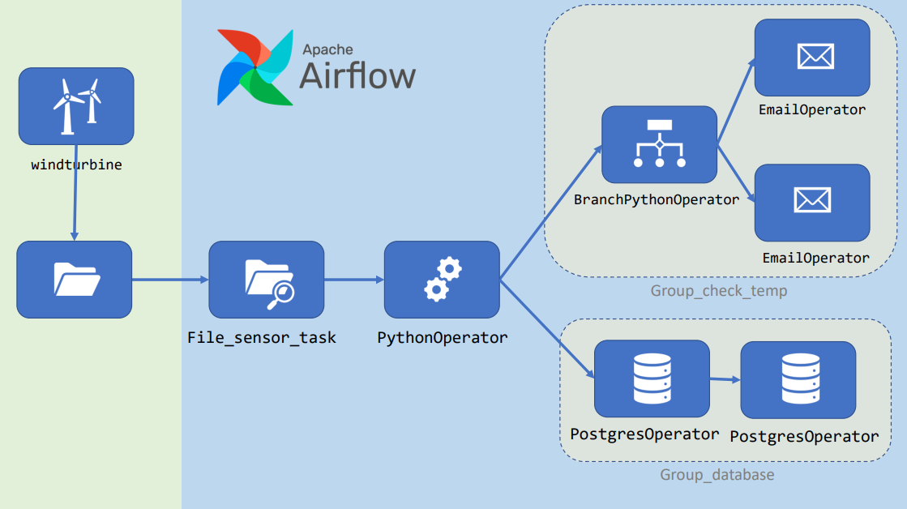

# Projeto Final: Apache Airflow

Este projeto consiste em uma pipeline de dados implementada com o Apache Airflow, que simula o monitoramento de dados gerados por uma turbina eólica. O pipeline realiza tarefas como detecção de arquivos, processamento de dados, tomada de decisão com base em condições e armazenamento dos dados em um banco de dados PostgreSQL.



## Objetivo
O objetivo do projeto é automatizar o fluxo de dados gerados por uma turbina eólica, incluindo o monitoramento de arquivos JSON, extração de informações, envio de alertas e armazenamento dos dados para análise posterior.

## Estrutura do Pipeline

1. **File Sensor Task**:
   - Verifica periodicamente a existência de um arquivo JSON em um caminho específico.
   - Configurações:
     - `filepath`: Caminho do arquivo monitorado.
     - `fs_conn_id`: ID de conexão do Airflow.
   - Observações:
     - Não monitora a pasta indefinidamente.
     - Não inicializa a DAG automaticamente quando o arquivo é disponibilizado.

2. **PythonOperator**:
   - Lê o arquivo JSON e extrai as seguintes variáveis:
     - `idtemp`
     - `powerfactor`
     - `hydraulicpressure`
     - `temperature`
     - `timestamp`
   - Remove o arquivo após a leitura.
   - Armazena os valores extraídos no XCom.

3. **BranchPythonOperator**:
   - Avalia a temperatura (`temperature`):
     - Se for maior ou igual a 24 graus, envia um e-mail de alerta.
     - Caso contrário, envia um e-mail informativo.

4. **PostgresOperator**:
   - Cria uma tabela no banco de dados PostgreSQL.
   - Insere os dados extraídos do arquivo JSON na tabela.

5. **EmailOperator**:
   - Responsável pelo envio de e-mails de alerta ou informativo, dependendo da condição avaliada.

## Pré-requisitos

1. Configurar a conexão para o `file_sensor_task`:
   - ID de conexão padrão: `fs_default`.
   - Caminho do arquivo: Variável configurável no Airflow.

2. Configurar a conexão com o banco de dados PostgreSQL no Airflow.

3. Configurar as credenciais de envio de e-mails no Airflow.

## Configuração do Agendamento
- Intervalo de execução: A cada 3 minutos (`"*/3 * * * *"`).
- Durante o desenvolvimento, o agendamento está configurado como `None`.

## Estrutura do Arquivo JSON
O arquivo JSON gerado pela turbina eólica segue o seguinte formato:

```json
{
  "idtemp": "1",
  "powerfactor": "0.8837929080361997",
  "hydraulicpressure": "78.86011124702158",
  "temperature": "25.279809506572597",
  "timestamp": "2023-03-19 17:26:55.230351"
}
```

## Execução
1. Certifique-se de que o Airflow esteja configurado e as conexões necessárias estejam criadas.
2. Inicialize o DAG no Airflow.
3. Suba o arquivo JSON no caminho configurado.
4. Observe a execução das tarefas no Airflow.

## Resultados Esperados
- Os dados do arquivo JSON serão armazenados no banco de dados PostgreSQL.
- Um e-mail será enviado com base na temperatura avaliada.
- O pipeline será executado automaticamente em intervalos regulares.

## Tecnologias Utilizadas
- Apache Airflow
- Python
- PostgreSQL
- Biblioteca de envio de e-mails

## Contato
Para dúvidas ou sugestões, entre em contato com o autor do projeto.